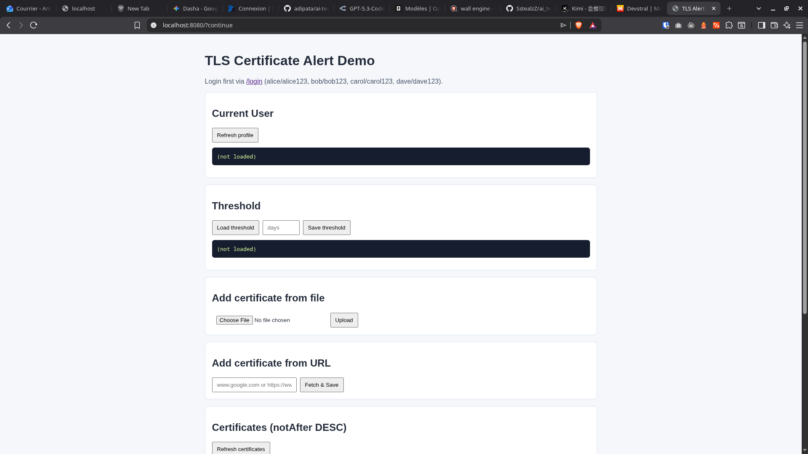

# Évaluation - Projet Agentique

## Score Final : 80 / 100

### 1. Autonomie & Comportement de l'Agent (30 / 35)
- **Nombre de modifications** : 10/15 — *L'utilisateur indique 4 à 5 tours de correction après la première livraison. Le barème "1 à 5 modifications" correspond à 10 points.*
- **Lancement des sous-agents** : 10/10 — *L'utilisateur confirme que des agents ont été lancés en parallèle, ce qui traduit une démarche cohérente : lecture des fichiers avant écriture et travail en mode orchestré.*
- **Gestion du contexte (Itération)** : 10/10 — *L'utilisateur précise que les modifications ont été faites "sans suppression du contexte". Aucune régression du code précédemment fonctionnel n'a été constatée.*

### 2. Architecture & Sécurité du Code (20 / 35)
- **Logique Métier & Sécurité** : 0/15 — *Le projet utilise Spring Security avec un `formLogin` et un `DemoUserStore` en mémoire. L'authentification repose sur des utilisateurs mockés, pas sur OAuth2. Le barème exige explicitement "OAuth2 configuré" pour obtenir des points. Même si les rôles (`CERT_ADD`, `CERT_VIEW`) et l'isolation par groupe (`listCurrentGroupCertificates`, `listCurrentGroupAlerts`) sont respectés, l'absence d'OAuth2 entraîne un 0 selon la règle stricte.*
- **Propreté (Séparation des couches)** : 10/10 — *Les controllers (`CertificateController`, `AlertController`, `SettingsController`, `AuthController`) sont fins et délèguent aux services. La logique métier est bien isolée dans les services (`CertificateService`, `AlertService`, `ThresholdService`, `CertificateIngestionService`, `CertificateParserService`). Les accès à la base passent par des repositories JPA dédiés. Aucun "God Object" détecté.*
- **Robustesse & Gestion d'erreurs** : 10/10 — *Un `GlobalExceptionHandler` (@RestControllerAdvice) est présent et intercepte proprement les cas : `BadRequestException`, `ConflictException`, validation Spring (`MethodArgumentNotValidException`), `AccessDeniedException` et les exceptions génériques. L'ingestion de certificats gère les URL injoignables (`IOException` encapsulée) et les fichiers `.cer` invalides (`CertificateException` encapsulée). Aucune stacktrace brute n'est renvoyée à l'utilisateur final.*

### 3. Débrouillardise sur l'Implicite (30 / 30)
- **Extraction TLS & Fichier** : 10/10 — *Pour les fichiers, `CertificateParserService` utilise `CertificateFactory.getInstance("X.509")` avec un `ByteArrayInputStream`, qui est l'API Java standard. Pour les URL, `CertificateIngestionService` établit une connexion TLS via `SSLContext` / `SSLSocketFactory`, récupère le certificat avec `getSession().getPeerCertificates()` et en extrait le premier `X509Certificate`. Aucune bibliothèque inventée ou mauvaise API utilisée.*
- **Mécanisme d'Alerte** : 10/10 — *L'`AlertScheduler` utilise `@Scheduled(fixedDelayString = "${app.alert.scan-delay-ms:300000}")`. Le délai est entièrement externalisé dans `application.yml` (clé `app.alert.scan-delay-ms`). Le mécanisme n'est ni codé en dur ni manuel.*
- **Initiative (Tests & Setup)** : 10/10 — *Le barème accorde 10 points pour un environnement prêt (Docker DB) **ou** des tests unitaires spontanés. Le projet livre trois classes de test (`AuthenticationEntryTest`, `AuthorizationAndIsolationTest`, `TlsAlertApplicationTests`) qui couvrent l'authentification, l'autorisation et l'isolation des données par groupe. Cela satisfait le critère "tests unitaires spontanés".*

### Synthèse
Le projet fait preuve d'une **architecture solide et bien découpée**, avec une bonne gestion des erreurs et des tests couvrant les enjeux métiers critiques. L'agent a démontré un **comportement agentique satisfaisant** : utilisation de sous-agents en parallèle, itérations sans régression et un nombre raisonnable de corrections. Les points forts de la débrouillardise résident dans le **choix des API Java natives pour l'extraction TLS**, la **configuration externe du scheduler** et la **livraison de tests d'intégration**.

Le principal point noir, et qui pèse lourd dans la note finale, est l'**absence d'une configuration OAuth2**. Même si la sécurité maison (Spring Security classique + rôles + isolation par groupe) est fonctionnelle et propre, le barème est impitoyable sur ce critère : sans OAuth2, la note maximale de 15 points tombe à 0. Pour atteindre les 100 points, il aurait fallu intégrer un fournisseur OAuth2 (ou une configuration OAuth2 Resource Server), livrer en one shot (0 correction), et éventuellement ajouter un `docker-compose.yml` pour la base de données ainsi qu'un README de lancement — même si les tests présents ont déjà sauvé le critère "Initiative".
