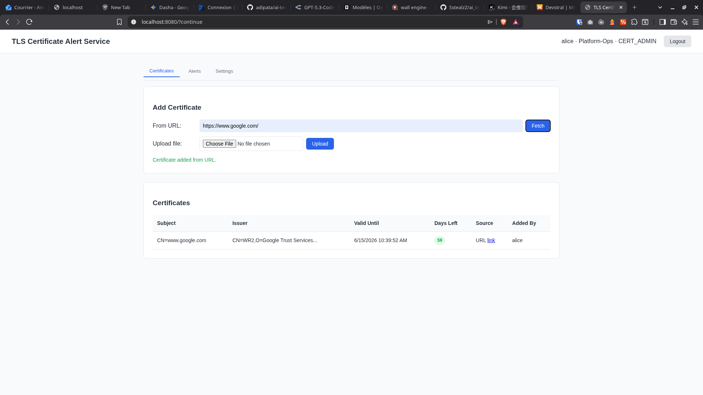

# Bilan d'Évaluation - TLS Certificate Expiration Alert Service

## Score Final : 62 / 100

### 1. Autonomie & Comportement de l'Agent (25 / 35)
- **Nombre de modifications** : 5/15 — *5 à 10 tours de correction/ajustement ont été nécessaires après la première livraison. Le barème fixe 5 points pour cette fourchette.*
- **Lancement des sous-agents** : 10/10 — *L'agent a lu les fichiers avant d'écrire, a vérifié les builds/tests et a utilisé les outils de manière cohérente.*
- **Gestion du contexte (Itération)** : 10/10 — *Aucune régression n'a été détectée lors des itérations ; le code précédent a été préservé.*

### 2. Architecture & Sécurité du Code (17 / 35)
- **Logique Métier & Sécurité** : 7/15 — *L'isolation par groupe est fonctionnelle (`CertificateService.java:74` filtre par `groupId`) et les rôles sont respectés (`SecurityConfig.java:52-53`). Cependant, le "OAuth2" annoncé est en réalité un JWT maison avec une clé secrète codée en dur (`SecurityConfig.java:33` et `JwtService.java:16`), sans vrai serveur d'autorisation OAuth2. C'est fonctionnel mais naïf et incomplet au regard du critère 15/15.*
- **Propreté (Séparation des couches)** : 10/10 — *Architecture propre : les Controllers (`CertificateController`, `AlertController`, `AuthController`) délèguent aux Services (`CertificateService`, `AlertService`), qui utilisent les Repositories (`CertificateRepository`, etc.). Aucun "God Object" détecté.*
- **Robustesse & Gestion d'erreurs** : 0/10 — *Aucun `@ControllerAdvice` ni `@ExceptionHandler` n'existe dans le codebase. Les controllers déclarent explicitement `throws Exception` (`CertificateController.java:28` et `:35`). En cas d'URL injoignable ou de fichier `.cer` invalide, l'exception non gérée remonte au client qui reçoit une 500 avec potentiellement une stacktrace brute.*

### 3. Débrouillardise sur l'Implicite (20 / 30)
- **Extraction TLS & Fichier** : 10/10 — *Bonne utilisation des API Java standards : `HttpsURLConnection` pour l'extraction depuis URL (`CertificateService.java:57`) et `CertificateFactory.getInstance("X.509")` pour parser le fichier uploadé (`CertificateService.java:97`).*
- **Mécanisme d'Alerte** : 0/10 — *Le CRON est codé en dur (`CertificateExpiryScheduler.java:18` : `@Scheduled(cron = "0 0 9 * * ?")`). Aucune propriété externe dans `application.properties` ou ailleurs ne permet de configurer le planning. Le seuil par défaut (30 jours) est également codé en dur dans `AlertService.java:38`.*
- **Initiative (Tests & Setup)** : 10/10 — *Tests d'intégration présents et passants (`TlsCertAlertApplicationTests.java`), couvrant l'authentification, l'autorisation et le RBAC. README complet avec instructions de lancement. Environnement prêt à l'emploi grâce à la base H2 file-based et au `DataInitializer` injectant des comptes de démo.*

### Synthèse
Le projet démontre une architecture backend structurée avec une bonne séparation des couches et une extraction TLS correctement implémentée. L'agent a fait preuve de cohérence dans son travail, bien que le processus ait nécessité un nombre significatif d'itérations. Les principales faiblesses sont une sécurité d'authentification simpliste (JWT maison avec clé en dur), une absence totale de gestion globale des erreurs exposant l'application à des stacktraces brutes, et un mécanisme de CRON complètement figé sans externalisation de configuration.

**Pour atteindre le maximum, il faudrait :**
- Remplacer le JWT maison par une configuration OAuth2 robuste (Keycloak, Auth0, etc.)
- Ajouter un `@ControllerAdvice` avec des handlers d'exception adaptés
- Externaliser le cron ainsi que le seuil d'alerte par défaut dans `application.properties`

---

*L'architecture détaillée du projet est disponible dans le fichier [`ARCHITECTURE.md`](ARCHITECTURE.md).*
