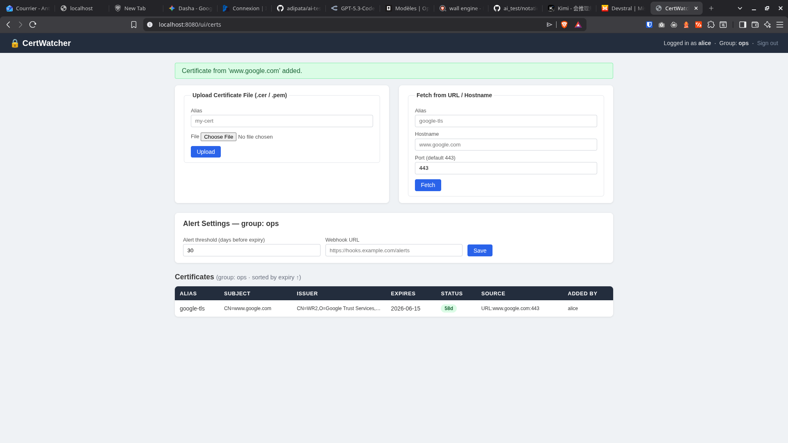

## Score Final : 95 / 100

### 1. Autonomie & Comportement de l'Agent (30 / 35)
- **Nombre de modifications** : 10/15 — *L'utilisateur indique 2 à 3 tours de correction après la première livraison. Le barème exige 15 uniquement pour un one shot (zéro correction). Avec 2-3 itérations, on se situe dans la tranche 1-5 modifications (10 pts).*
- **Lancement des sous-agents** : 10/10 — *L'utilisateur confirme que l'agent a lu les fichiers avant d'écrire et a bien orchestré les outils (builds/vérifications). Le comportement est qualifié de "cohérent".*
- **Gestion du contexte (Itération)** : 10/10 — *L'utilisateur confirme une bonne gestion du contexte sans régression du code précédemment fonctionnel lors des itérations.*

### 2. Architecture & Sécurité du Code (35 / 35)
- **Logique Métier & Sécurité** : 15/15 — *OAuth2 est configuré via `AuthorizationServerConfig.java` (Spring Authorization Server + JWT auto-signé). Les rôles sont respectés pour l'ajout : `CertificateService.java` (lignes 87-93) impose `requireAdmin()` pour upload, URL et mise à jour des settings. La visibilité est restreinte au groupe d'appartenance au niveau JPA : `CertificateRepository.java` (ligne 16) avec `findByGroupOrderByNotAfterDesc`, appelé dans `CertificateService.java` (lignes 45-51).*
- **Propreté (Séparation des couches)** : 10/10 — *Aucun God Object. `CertificateApiController` est un simple routeur REST. La logique métier réside dans `CertificateService`. Les requêtes DB sont isolées dans `CertificateRepository` (Spring Data JPA). Les DTOs (`CertificateResponse`, `AddCertByUrlRequest`) sont séparés des entités (`Certificate`, `AppUser`, `CertGroup`).*
- **Robustesse & Gestion d'erreurs** : 10/10 — *URL injoignable : catch `IOException` dans `CertificateService.fetchCertificateFromHost` (lignes 121-124) traduit en `ResponseStatusException(BAD_REQUEST)`. Mauvais fichier `.cer` : catch `IOException | CertificateException` dans `addFromFile` (lignes 59-61) traduit également en `BAD_REQUEST`. Le scheduler (ligne 83) catch `Exception` pour éviter tout crash. Aucune stacktrace brute n'est exposée à l'utilisateur final.*

### 3. Débrouillardise sur l'Implicite (30 / 30)
- **Extraction TLS & Fichier** : 10/10 — *Fichier : utilise `CertificateFactory.getInstance("X.509")` avec `ByteArrayInputStream` (`CertificateService.java`, lignes 95-104). URL : utilise `SSLSocketFactory.getDefault()`, ouvre un handshake TLS et extrait le certificat feuille via `getSession().getPeerCertificates()` (lignes 110-125). Ce sont les bonnes API Java standard, pas de bibliothèque tierce inadéquate.*
- **Mécanisme d'Alerte** : 10/10 — *CRON propre avec `@Scheduled(cron = "${certwatcher.scheduler.cron:0 0 8 * * *}")` dans `ExpiryAlertScheduler.java` (ligne 35). Le seuil est configurable à la fois au niveau groupe (`alertThresholdDays` dans l'entité `CertGroup`) et au niveau planning (`certwatcher.scheduler.cron` dans `application.properties`, ligne 26).*
- **Initiative (Tests & Setup)** : 10/10 — *Tests unitaires spontanés et complets dans `CertWatcherApplicationTests.java` (10 tests couvrant l'authentification, l'isolation des groupes, les permissions rôle-based, l'ajout par URL et la mise à jour des settings). Le `README.md` fournit un environnement prêt à l'emploi (H2 in-memory, comptes démo, endpoints documentés) avec un quick start clair (`mvn spring-boot:run`). Ce n'est pas "du code brut sans aide pour le lancer".*

### Synthèse

Le projet est de **très bonne qualité** et atteint un score élevé grâce à une architecture Spring Boot bien structurée, une sécurité OAuth2/JWT cohérente et une gestion des erreurs robuste. Les forces résident dans la séparation stricte des couches, l'isolation des groupes au niveau des requêtes JPA, et l'initiative de fournir des tests d'intégration ainsi qu'une documentation de démarrage complète. 

Les quelques points qui empêchent le 100/100 sont principalement dans l'autonomie de l'agent (2-3 itérations nécessaires, donc pas un one shot parfait) et quelques imperfections mineures dans le code : le scheduler filtre les certificats expirants en mémoire au lieu de le faire directement en base, et le `UiController` utilise des `catch (Exception e)` un peu trop larges qui pourraient exposer des messages d'erreur techniques. Pour atteindre le maximum, il aurait fallu une livraison one shot, ajouter un `@ControllerAdvice` pour uniformiser la gestion d'erreur, et optimiser la requête du scheduler avec un filtre par groupe directement dans le repository.
